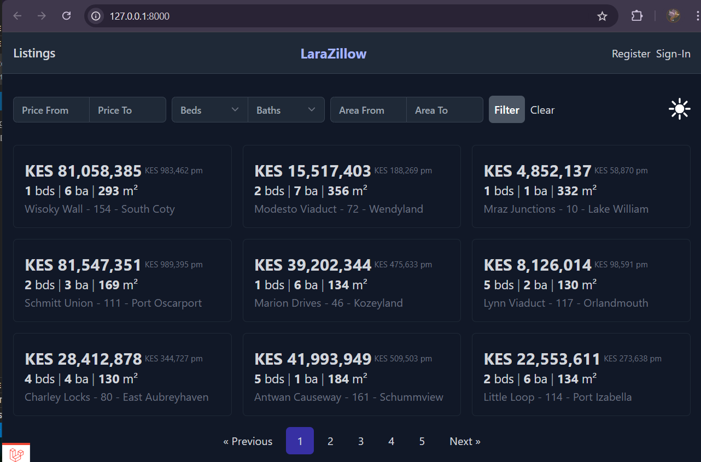
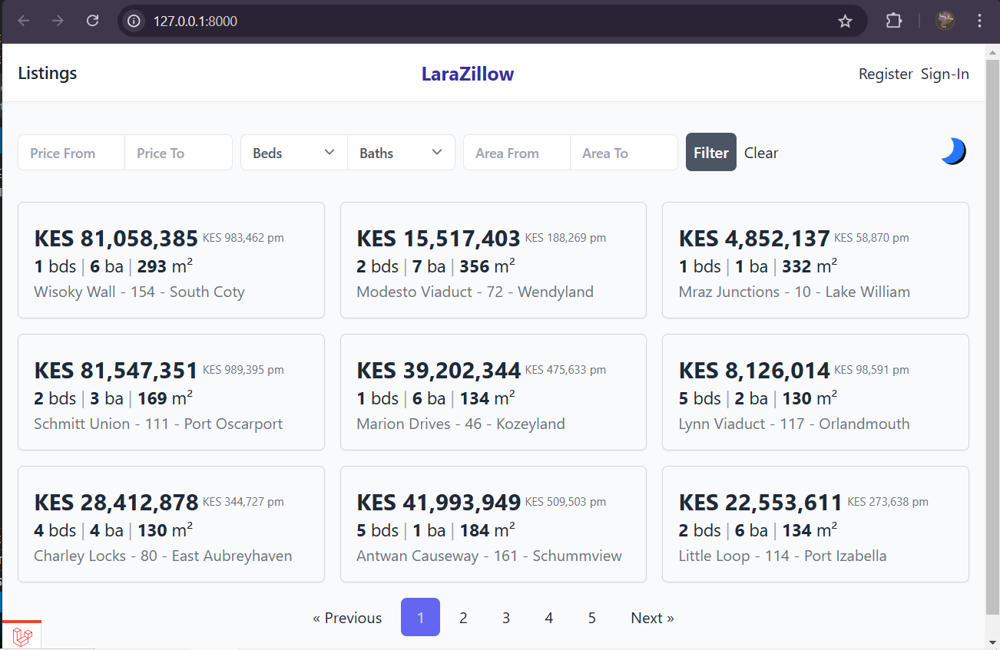

# Larazillow

Larazillow is a powerful real estate application built using Laravel, Vue.js, and Inertia.js. It enables users to register as realtors, list properties for sale, view property listings, and make offers on houses, providing an all-in-one platform for real estate transactions.

---

## Features
- **User Registration and Roles**: Sign up as a user or a realtor.
- **Property Listings**: View all available properties on the platform.
- **Offers**: Make offers directly on listed properties.
- **Realtor Management**: Realtors can manage their property listings and view offers.

---

## Screenshot





---

## Installation and Setup

Follow these steps to run Larazillow locally:

### Prerequisites
- PHP 8.1 or higher
- Composer
- Node.js & npm
- MySQL database
- Git

### Steps

1. **Clone the Repository**
   ```bash
   git clone https://github.com/NjauSamuel/Lara_Zillow.git
   cd larazillow
   ```

2. **Install Dependencies**
   - Backend dependencies:
     ```bash
     composer install
     ```
   - Frontend dependencies:
     ```bash
     npm install
     ```

3. **Environment Setup**
   Copy the `.env.example` file to create a `.env` file and configure your database credentials.
   ```bash
   cp .env.example .env
   ```
   Update the following lines in the `.env` file:
   ```env
   DB_DATABASE=your_database_name
   DB_USERNAME=your_database_user
   DB_PASSWORD=your_database_password
   ```

4. **Generate Application Key**
   ```bash
   php artisan key:generate
   ```

5. **Run Migrations and Seeders**
   ```bash
   php artisan migrate --seed
   ```

6. **Build Frontend Assets**
   ```bash
   npm run dev
   ```

7. **Start the Development Server**
   ```bash
   php artisan serve
   ```
   Access the application at `http://localhost:8000`.

---

## Usage
- Register for an account or log in as a realtor.
- Browse the available property listings.
- Realtors can add, edit, or remove their property listings.
- Users can make offers on properties directly through the platform.

---

## Contributing
Contributions are welcome! Please fork the repository and submit a pull request with your improvements. [Samuel Njau](https://www.linkedin.com/in/samuel-njau/)

---

## License
This project is licensed under the MIT License. See the LICENSE file for details.

